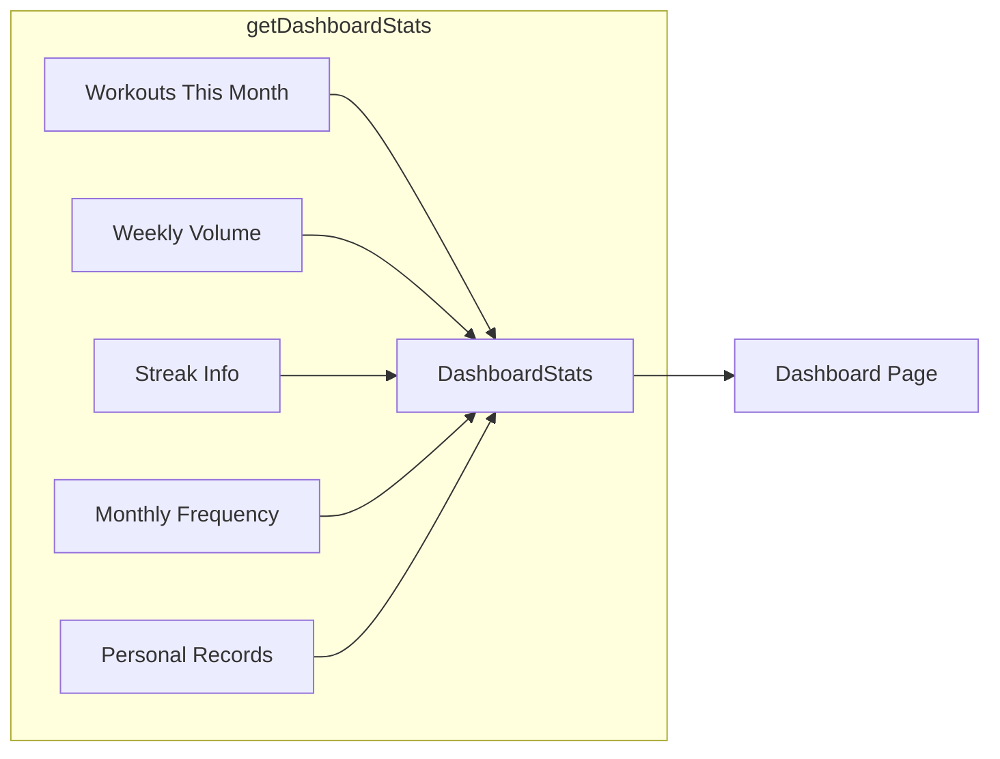

# Dashboard Data Aggregation Design

This document describes the architecture for all dashboard data aggregation in LiftingDiary.

## Overview

All aggregation logic lives in [src/db/queries/stats.ts](file:///d:/vibe%20code/LiftingDiary/lifting-diary/src/db/queries/stats.ts). The dashboard page calls one unified entrypoint — [getDashboardStats()](file:///d:/vibe%20code/LiftingDiary/lifting-diary/src/db/queries/stats.ts#216-255) — which runs all queries **in parallel** via `Promise.all` for best performance.



---

## 1. Monthly Workout Frequency

**Function**: [getMonthlyFrequency(userId, months = 6)](file:///d:/vibe%20code/LiftingDiary/lifting-diary/src/db/queries/stats.ts#46-85)

| Detail | Value |
|---|---|
| **Purpose** | Bar chart data — workouts per month for the last N months |
| **Query** | `GROUP BY to_char(date, 'YYYY-MM')` with count + sum of duration |
| **Gap Filling** | App-level loop fills months with zero workouts so the chart is continuous |

### Return Type

```typescript
interface MonthlyFrequency {
  month: string;         // "2026-02"
  label: string;         // "Feb"
  count: number;         // workouts in this month
  totalDuration: number; // sum of duration (minutes)
}
```

### Rendering

The dashboard renders this as a simple **CSS bar chart** — no charting library needed. Each bar's height is proportional to `count / maxCount`.

---

## 2. Personal Records

**Function**: [getPersonalRecords(userId, limit = 10)](file:///d:/vibe%20code/LiftingDiary/lifting-diary/src/db/queries/stats.ts#88-126)

| Detail | Value |
|---|---|
| **Purpose** | Show the heaviest single set ever logged per exercise |
| **Query** | `GROUP BY exercise`, `max(sets.weight)`, with `array_agg(...ORDER BY weight DESC)[1]` to get the reps and date of the max-weight row |
| **Filter** | Only includes sets where `weight > 0` (excludes bodyweight / cardio) |

### Return Type

```typescript
interface PersonalRecord {
  exerciseName: string;
  muscleGroup: string | null;
  maxWeight: number;     // heaviest weight ever lifted
  repsAtMax: number;     // reps in that specific set
  date: Date;            // when it happened
  workoutId: number;     // link to the workout
}
```

### Key Decision: `array_agg` Trick

> [!TIP]
> Instead of using a correlated subquery or window function, we use PostgreSQL's `array_agg(column ORDER BY weight DESC)[1]` to grab the corresponding values from the row with the highest weight. This is a single-pass aggregation — no self-join required.

---

## 3. Streak Calculation

**Function**: [getStreakInfo(userId)](file:///d:/vibe%20code/LiftingDiary/lifting-diary/src/db/queries/stats.ts#129-185)

| Detail | Value |
|---|---|
| **Purpose** | Track current consecutive-day streak AND all-time longest streak |
| **Query** | `SELECT DISTINCT ON (date::date)` to get unique workout days |
| **Algorithm** | App-level loop walks backward through sorted dates |

### Return Type

```typescript
interface StreakInfo {
  current: number;          // active streak (0 if broken)
  longest: number;          // all-time best streak
  lastWorkoutDate: Date | null;
}
```

### Algorithm

```
1. Fetch unique workout dates, DESC sorted
2. Current Streak:
   - If most recent workout was today or yesterday → streak starts at 1
   - Walk backward: if each consecutive date is exactly 1 day apart → increment
   - Stop at first gap
3. Longest Streak:
   - Walk through ALL dates
   - Track running streak length, keep max
```

> [!IMPORTANT]
> A streak is **not broken** if the user works out today or yesterday. This gives a "grace period" — the streak only resets if 2+ days pass without a workout.

---

## 4. Volume Calculation

**Function**: [getVolumeForRange(userId, from, to)](file:///d:/vibe%20code/LiftingDiary/lifting-diary/src/db/queries/stats.ts#188-213)

| Detail | Value |
|---|---|
| **Formula** | `SUM(weight × reps)` across all sets in the date range |
| **Used By** | [getDashboardStats](file:///d:/vibe%20code/LiftingDiary/lifting-diary/src/db/queries/stats.ts#216-255) for "Weekly Volume" card |
| **Reusable** | Can be called for any date range (week, month, custom) |

---

## 5. Unified Dashboard Fetch

**Function**: [getDashboardStats(userId)](file:///d:/vibe%20code/LiftingDiary/lifting-diary/src/db/queries/stats.ts#216-255)

Runs all five queries in parallel:

```typescript
const [workoutsThisMonth, volumeThisWeek, streak, monthlyFrequency, personalRecords] =
  await Promise.all([ ... ]);
```

### Performance Characteristics

| Query | Expected Latency | Notes |
|---|---|---|
| Workouts this month | ~5ms | Simple count with index on `user_id + date` |
| Weekly volume | ~10ms | JOIN through 3 tables, filtered by date |
| Streak info | ~8ms | DISTINCT ON + app-level loop |
| Monthly frequency | ~12ms | GROUP BY with gap-fill |
| Personal records | ~15ms | GROUP BY + array_agg aggregation |

> [!NOTE]
> All queries run in parallel. Total wall-clock time ≈ slowest single query (~15ms), not the sum.

---

## Data Flow

```
DashboardPage (Server Component)
  ├── auth() → clerkUserId
  ├── db.select(users) → dbUser.id
  └── Promise.all([
  │     getDashboardStats(dbUser.id),
  │     getWorkouts(dbUser.id, 1, 5)
  │   ])
  └── Renders:
        ├── 4× Stat Cards (month count, streak, volume, last workout)
        ├── Monthly Frequency bar chart
        ├── Personal Records list
        └── Recent Activity list
```
